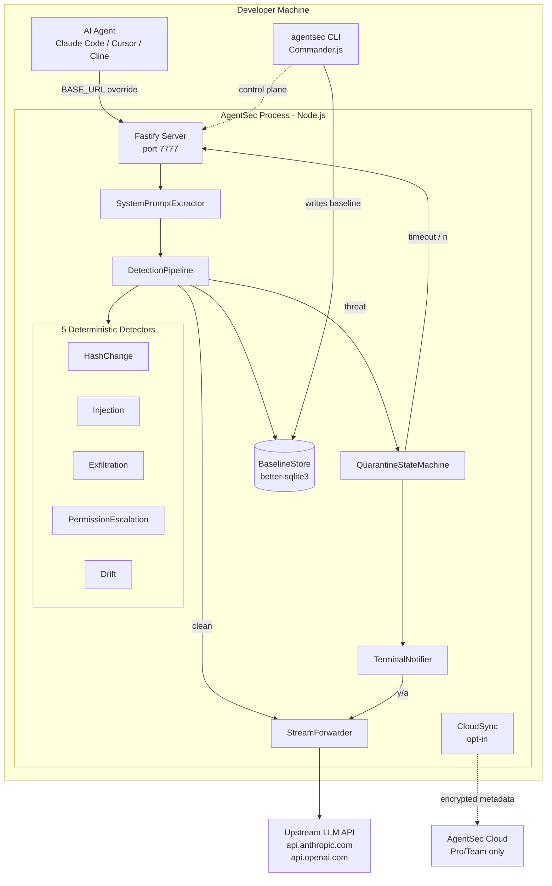
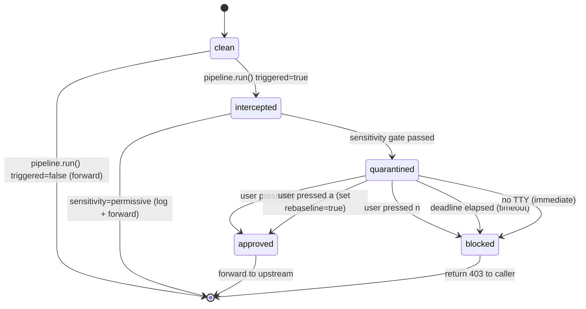

# AgentSec — Design Document (Phase 1)

This document captures the architecture, data model, and technical decisions
for Phase 1 of AgentSec. It is the source of truth for _how_ the system is
built; `requirements.md` is the source of truth for _what_ the system does.

---

## 1. Architecture Overview



---

## 2. Ten Key Technical Decisions

| #   | Decision                                         | Choice                              | Rationale                                                                                                                                                                              | Alternatives rejected                                                                                                                                 |
| --- | ------------------------------------------------ | ----------------------------------- | -------------------------------------------------------------------------------------------------------------------------------------------------------------------------------------- | ----------------------------------------------------------------------------------------------------------------------------------------------------- |
| 1   | **HTTP server framework**                        | Fastify                             | TypeScript-native, low overhead, first-class stream support, built-in request lifecycle hooks. Established in security tooling space.                                                  | Express (slower, less typed); Hono (great but smaller ecosystem); raw `node:http` (too low-level for the request lifecycle hooks we need)             |
| 2   | **Streaming model**                              | `stream.pipeline()` end-to-end      | Node's built-in pipeline handles backpressure correctly and closes both ends on error. Zero accumulation of response body in memory.                                                   | Manual `req.pipe(res)` (no error handling); accumulating then re-sending (defeats SSE)                                                                |
| 3   | **Encryption**                                   | AES-256-GCM via Node `crypto`       | Authenticated encryption; built-in (no third-party crypto on critical path); FIPS-friendly.                                                                                            | `libsodium-wrappers` (extra dep on critical path); ChaCha20-Poly1305 (no Node built-in until 18+)                                                     |
| 4   | **Key derivation**                               | PBKDF2-SHA256, 100k iters           | Built-in to Node; well-understood; passes OWASP min. Argon2 would be better but requires native binding.                                                                               | scrypt (slower; equivalent security); Argon2 (native dep); plain SHA256 of password (insecure)                                                        |
| 5   | **Baseline storage**                             | `better-sqlite3` (sync)             | Synchronous API simplifies CLI commands and lifecycle hooks. Single-process is fine for a local tool. Faster than `sqlite3` (async).                                                   | `sqlite3` (async, complicates Fastify hooks); LMDB (overkill); plain JSON file (no concurrent-write safety)                                           |
| 6   | **Detection pipeline**                           | Array of `Detector` pure functions  | Each detector is `(ctx) => DetectorResult`. No I/O, no async, no side effects. Trivially composable, testable, extensible.                                                             | Class hierarchy (over-engineered); plugin system with dynamic loading (defeats static analysis goal); LLM-based chain (violates NFR-13)               |
| 7   | **CLI framework**                                | Commander.js                        | De facto standard for Node CLIs. Subcommand support, autogen help, low boilerplate.                                                                                                    | yargs (heavier); oclif (way too heavy); raw `process.argv` (no UX)                                                                                    |
| 8   | **Test framework**                               | Vitest                              | Fast, TypeScript-native, no config, Jest-API-compatible. Built-in coverage. Watch mode fast enough for TDD.                                                                            | Jest (slower with TS); node:test (immature ecosystem); ava (smaller ecosystem)                                                                        |
| 9   | **Cloud API stack** (hosted tier, separate repo) | Fastify + PostgreSQL + Prisma       | Same Fastify on both sides simplifies the dev's mental model. Postgres for audit log, Prisma for schema migrations.                                                                    | Express/Postgres/Knex (older), Hono/Drizzle (good but newer; lower team familiarity)                                                                  |
| 10  | **TLS interception (Phase 1)**                   | None — agent BASE_URL override only | Zero friction (no cert install); works with Claude Code, Cursor, Cline, and any SDK that honours `BASE_URL`. Adding TLS interception later (Phase 2 advanced mode) is purely additive. | Local CA install (high friction for the MVP audience); MITM with self-signed (rejected by modern HTTPS stacks); kernel-level packet filter (overkill) |

---

## 3. Module Layout

```
agentsec/
├── src/
│   ├── proxy/
│   │   ├── server.ts                # Fastify app factory; routes
│   │   ├── extractor.ts             # SystemPromptExtractor (pure)
│   │   ├── forwarder.ts             # Stream-pipe upstream forwarder
│   │   └── log-scrubber.ts          # Redacts secrets from logs
│   ├── detectors/
│   │   ├── pipeline.ts              # DetectionPipeline orchestrator
│   │   ├── hash.ts                  # HashChangeDetector
│   │   ├── injection.ts             # InjectionPatternDetector
│   │   ├── injection-patterns.ts    # Built-in regex set (frozen)
│   │   ├── exfiltration.ts          # ExfiltrationDetector
│   │   ├── exfiltration-patterns.ts # Built-in regex set (frozen)
│   │   ├── escalation.ts            # PermissionEscalationDetector
│   │   └── drift.ts                 # DriftAlertDetector
│   ├── quarantine/
│   │   ├── state-machine.ts         # QuarantineStateMachine
│   │   ├── terminal-notifier.ts     # diff renderer + y/n/a prompt
│   │   └── tty.ts                   # TTY detection
│   ├── baseline/
│   │   ├── store.ts                 # BaselineStore (better-sqlite3 + AES-256-GCM)
│   │   ├── schema.sql               # SQLite schema
│   │   └── crypto.ts                # AES-256-GCM + PBKDF2 wrappers
│   ├── cli/
│   │   ├── index.ts                 # Commander.js entrypoint
│   │   └── commands/
│   │       ├── start.ts
│   │       ├── approve.ts
│   │       ├── log.ts
│   │       ├── status.ts
│   │       ├── config.ts
│   │       ├── bypass.ts
│   │       └── exempt.ts
│   ├── cloud/
│   │   ├── sync.ts                  # Encrypted metadata POST
│   │   └── policy-pull.ts           # Pro-tier rule pull
│   ├── config.ts                    # Env + YAML config loader
│   ├── errors.ts                    # Domain Error subclasses
│   ├── types.ts                     # Shared types only
│   └── version.ts                   # Single source of truth for version string
├── tests/
│   ├── unit/                        # One file per src/ module
│   ├── integration/                 # Real Fastify + fake-upstream
│   └── e2e/                         # Real CLI subprocess + real proxy
├── scripts/
│   ├── check-traceability.ts        # FR/NFR ↔ tasks check (CI)
│   └── check-no-llm-calls.ts        # NFR-13 enforcement (CI grep)
├── .agentsec/
│   └── config.yaml.example
├── .github/
│   ├── copilot-instructions.md
│   └── workflows/
│       └── ci.yml
├── package.json
├── tsconfig.json
├── vitest.config.ts
├── README.md
├── LICENSE                          # Apache 2.0
├── .env.example
└── CHANGELOG.md
```

---

## 4. Data Model

### 4.1 SQLite schema (local baseline store)

```sql
-- src/baseline/schema.sql

PRAGMA journal_mode = WAL;
PRAGMA foreign_keys = ON;

-- One row per (project, provider) combination.
CREATE TABLE IF NOT EXISTS baselines (
    project_id       TEXT NOT NULL,
    provider         TEXT NOT NULL CHECK (provider IN ('anthropic', 'openai')),
    prompt_hash      TEXT NOT NULL,                     -- SHA-256 lowercase hex
    ciphertext       BLOB NOT NULL,                     -- AES-256-GCM(prompt + tools_json)
    iv               BLOB NOT NULL,                     -- 12 bytes
    auth_tag         BLOB NOT NULL,                     -- 16 bytes
    salt             BLOB NOT NULL,                     -- 16 bytes (per-baseline)
    approved_at      TEXT NOT NULL DEFAULT (strftime('%Y-%m-%dT%H:%M:%fZ','now')),
    approved_by      TEXT NOT NULL DEFAULT 'local',     -- 'local' | 'cloud_policy'
    PRIMARY KEY (project_id, provider)
);

-- Append-only audit log of every detection + decision.
CREATE TABLE IF NOT EXISTS audit_log (
    id               INTEGER PRIMARY KEY AUTOINCREMENT,
    timestamp        TEXT NOT NULL DEFAULT (strftime('%Y-%m-%dT%H:%M:%fZ','now')),
    project_id       TEXT NOT NULL,
    provider         TEXT NOT NULL,
    detector_names   TEXT NOT NULL,                     -- JSON array of names that triggered
    severity         TEXT NOT NULL CHECK (severity IN ('info','warn','high')),
    decision         TEXT NOT NULL CHECK (decision IN ('clean','approved','blocked','timeout','bypass','exempt','rebaseline')),
    prompt_hash      TEXT NOT NULL,
    upstream_status  INTEGER                              -- HTTP status returned to caller
);
CREATE INDEX IF NOT EXISTS idx_audit_project_time ON audit_log(project_id, timestamp DESC);

-- Per-project exempt patterns (encrypted).
CREATE TABLE IF NOT EXISTS exempt_patterns (
    project_id       TEXT NOT NULL,
    ciphertext       BLOB NOT NULL,
    iv               BLOB NOT NULL,
    auth_tag         BLOB NOT NULL,
    salt             BLOB NOT NULL,
    created_at       TEXT NOT NULL DEFAULT (strftime('%Y-%m-%dT%H:%M:%fZ','now')),
    PRIMARY KEY (project_id, ciphertext)
);

-- Active bypass state (one row per project at most).
CREATE TABLE IF NOT EXISTS bypass (
    project_id       TEXT PRIMARY KEY,
    expires_at       TEXT NOT NULL,
    created_at       TEXT NOT NULL DEFAULT (strftime('%Y-%m-%dT%H:%M:%fZ','now'))
);

-- Sync queue for cloud-bound events (Pro/Team only).
CREATE TABLE IF NOT EXISTS cloud_sync_queue (
    id               INTEGER PRIMARY KEY AUTOINCREMENT,
    payload_json     TEXT NOT NULL,                     -- Pre-serialized minimised payload
    enqueued_at      TEXT NOT NULL DEFAULT (strftime('%Y-%m-%dT%H:%M:%fZ','now')),
    last_attempt_at  TEXT,
    attempts         INTEGER NOT NULL DEFAULT 0
);
```

### 4.2 Core TypeScript types

```ts
// src/types.ts

export type Provider = "anthropic" | "openai";

export interface ToolDescriptor {
  name: string;
  description?: string;
  inputSchema: unknown; // JSON schema (raw)
}

export interface NormalizedPrompt {
  provider: Provider;
  system: string; // Always a single string (arrays joined with \n)
  tools: ToolDescriptor[];
  raw: unknown; // Original parsed body (untrusted)
}

export interface DetectionContext {
  prompt: NormalizedPrompt;
  baseline: Baseline | null; // null when no baseline approved
  exemptPatterns: string[]; // Decrypted at request start
}

export interface DetectorResult {
  triggered: boolean;
  severity: "info" | "warn" | "high";
  evidence: string[]; // Human-readable evidence strings
  error?: string; // Set if the detector itself threw
}

export interface ThreatReport {
  triggered: boolean;
  highestSeverity: "info" | "warn" | "high";
  hits: Array<{ name: string; result: DetectorResult }>;
}

export interface Detector {
  readonly name: string;
  detect(ctx: DetectionContext): DetectorResult; // synchronous, pure
}

export interface Baseline {
  projectId: string;
  provider: Provider;
  promptHash: string;
  system: string; // Plaintext after decryption
  tools: ToolDescriptor[];
  approvedAt: string; // ISO 8601
}

export type QuarantineState =
  | { kind: "clean" }
  | { kind: "intercepted"; report: ThreatReport }
  | { kind: "quarantined"; report: ThreatReport; deadline: number }
  | { kind: "approved"; rebaseline: boolean }
  | { kind: "blocked"; reason: "user_deny" | "timeout" | "no_tty" };
```

---

## 5. Detection Pipeline

```ts
// src/detectors/pipeline.ts (sketch)

export class DetectionPipeline {
  constructor(private readonly detectors: readonly Detector[]) {}

  run(ctx: DetectionContext): ThreatReport {
    const hits: ThreatReport["hits"] = [];
    let highest: "info" | "warn" | "high" = "info";

    for (const det of this.detectors) {
      let result: DetectorResult;
      try {
        result = det.detect(ctx);
      } catch (e) {
        // NFR-10: partial-failure isolation
        result = {
          triggered: false,
          severity: "info",
          evidence: [],
          error: (e as Error).message,
        };
      }
      hits.push({ name: det.name, result });
      if (
        result.triggered &&
        severityRank(result.severity) > severityRank(highest)
      ) {
        highest = result.severity;
      }
    }

    return {
      triggered: hits.some((h) => h.result.triggered),
      highestSeverity: highest,
      hits,
    };
  }
}
```

---

## 6. Quarantine State Machine



Fail-secure invariants:

- `quarantined → approved` requires explicit user action OR cloud-policy
  pre-approval (Pro tier, future).
- `quarantined → blocked` is the default on any non-explicit-approval path.

---

## 7. Encryption Details

```ts
// src/baseline/crypto.ts (sketch)

import {
  createCipheriv,
  createDecipheriv,
  pbkdf2Sync,
  randomBytes,
} from "node:crypto";

const KEY_LEN = 32; // AES-256
const IV_LEN = 12; // GCM standard
const SALT_LEN = 16;
const ITERATIONS = 100_000;

export function deriveKey(secret: string, salt: Buffer): Buffer {
  return pbkdf2Sync(secret, salt, ITERATIONS, KEY_LEN, "sha256");
}

export function encrypt(
  plaintext: string,
  secret: string,
): { ciphertext: Buffer; iv: Buffer; authTag: Buffer; salt: Buffer } {
  const salt = randomBytes(SALT_LEN);
  const iv = randomBytes(IV_LEN);
  const key = deriveKey(secret, salt);
  const cipher = createCipheriv("aes-256-gcm", key, iv);
  const ciphertext = Buffer.concat([
    cipher.update(plaintext, "utf8"),
    cipher.final(),
  ]);
  const authTag = cipher.getAuthTag();
  return { ciphertext, iv, authTag, salt };
}

export function decrypt(
  ciphertext: Buffer,
  iv: Buffer,
  authTag: Buffer,
  salt: Buffer,
  secret: string,
): string {
  const key = deriveKey(secret, salt);
  const decipher = createDecipheriv("aes-256-gcm", key, iv);
  decipher.setAuthTag(authTag);
  const plaintext = Buffer.concat([
    decipher.update(ciphertext),
    decipher.final(),
  ]);
  return plaintext.toString("utf8");
}
```

Notes:

- Salt is per-baseline (stored alongside the ciphertext) — guarantees unique
  derived keys even when two projects use the same `AGENTSEC_KEY`.
- IV is per-encryption — required for GCM correctness.
- `authTag` mismatch on decryption throws — surfaced as `EncryptionError`,
  blocks the proxy from forwarding.

---

## 8. Provider Auto-Detection

```ts
// src/proxy/extractor.ts (sketch)

export function extract(req: { url: string; body: unknown }): NormalizedPrompt {
  if (req.url.startsWith("/v1/messages")) {
    return extractAnthropic(req.body);
  }
  if (req.url.startsWith("/v1/chat/completions")) {
    return extractOpenAI(req.body);
  }
  throw new InvalidProviderError(`Unknown route: ${req.url}`);
}
```

Anthropic extraction normalizes the `system` field whether it's a string or an
array of `{ type: 'text', text: '...' }` content blocks. OpenAI extraction
finds the first message with `role: 'system'`. Both produce the same
`NormalizedPrompt`.

---

## 9. Config Resolution

Resolution order (highest wins):

1. CLI flags (`--port`, `--sensitivity`, etc.)
2. Environment variables (`AGENTSEC_*`)
3. `.agentsec/config.yaml` in CWD
4. `~/.agentsec/config.yaml` (user-global)
5. Built-in defaults

```yaml
# .agentsec/config.yaml.example

port: 7777
sensitivity: balanced # strict | balanced | permissive
quarantine_timeout_sec: 60
project: "" # overrides CWD-hash project_id
cloud:
  enabled: false
  api_url: https://agentsec.dev/api
  api_key: "" # also accepts AGENTSEC_CLOUD_API_KEY env
  webhook_url: ""
  webhook_format: generic # telegram | slack | generic
```

`AGENTSEC_KEY` is **never** read from YAML — only env var. This prevents the
encryption key from ending up in version control.

---

## 10. CI Enforcement (NFR-13)

`scripts/check-no-llm-calls.ts` runs in CI and fails the build if any of the
following strings appear in `src/detectors/`, `src/quarantine/`, or
`src/baseline/`:

- `anthropic.com`
- `openai.com`
- `api.anthropic`
- `api.openai`
- `/v1/messages` (this string is only allowed in `src/proxy/extractor.ts` and `src/proxy/server.ts`)
- `/v1/chat/completions` (same exception)
- import of `@anthropic-ai/sdk` or `openai` packages

This is a static, auditable, deterministic enforcement of the trust model.
It is itself a deterministic rule.

---

## 11. Observability

- **Structured logs** via `pino` (high-perf Node logger). One log line per
  request: `{ ts, project_id, provider, decision, detectors_triggered, ms }`.
- **Log scrubber middleware** redacts `authorization`, `api-key`,
  `x-api-key`, and any value matching `sk-[A-Za-z0-9]{20,}` before write.
- **Audit log table** persists every detection (success or failure) to SQLite.
- **Counters** exposed at `GET /metrics` (internal port only — not the
  forwarding port) for Prometheus scraping if the user wants it.

Failure-mode observability:

- `cloud_sync_failures.log` — appended on every cloud-sync POST error.
- `quarantine_timeouts.log` — appended on every timeout-blocked request.
- `detector_errors.log` — appended when a detector throws (per NFR-10).

---

## 12. Threats Out of Scope (and Why)

| Threat                                                                   | Why not Phase 1                                                                                                                                    |
| ------------------------------------------------------------------------ | -------------------------------------------------------------------------------------------------------------------------------------------------- |
| Agent making LLM call directly (bypassing BASE_URL override)             | Out of band of a transparent proxy. Phase 2 ships local CA + iptables redirect as advanced mode.                                                   |
| Compromised AgentSec binary                                              | Out of scope of AgentSec's own logic. Mitigated by Apache 2.0 source-available + npm package signing + reproducible builds (Phase 2).              |
| Compromised `AGENTSEC_KEY`                                               | Out of scope. Encryption is only as strong as the key. Documented in deployment runbook.                                                           |
| Side-channel attacks on PBKDF2 timing                                    | Out of scope. The threat model is software supply-chain and prompt manipulation, not nation-state side-channels.                                   |
| Encrypted prompt content extracted from disk + brute-forced offline      | Mitigated by PBKDF2 100k iterations + AES-256-GCM. A 32+ char `AGENTSEC_KEY` is not brute-forceable in practical time.                             |
| Race condition between `agentsec approve` and a concurrent proxy request | `better-sqlite3` serializes writes; the proxy reads baseline at request start; concurrent approve is a no-op on the in-flight request. Documented. |

---

## 13. Open Design Questions (deferred)

| Question                                            | Phase to resolve                              |
| --------------------------------------------------- | --------------------------------------------- |
| Multi-machine baseline sync                         | Phase 2 (with hosted dashboard)               |
| Per-detector severity overrides via cloud policy    | Phase 2                                       |
| Detector confidence scores vs. binary triggered     | Phase 2 (only if false-positive rate is real) |
| WebSocket / event-stream API for live dashboard     | Phase 2                                       |
| Detector "explain" endpoint (why did this trigger?) | Phase 2                                       |
