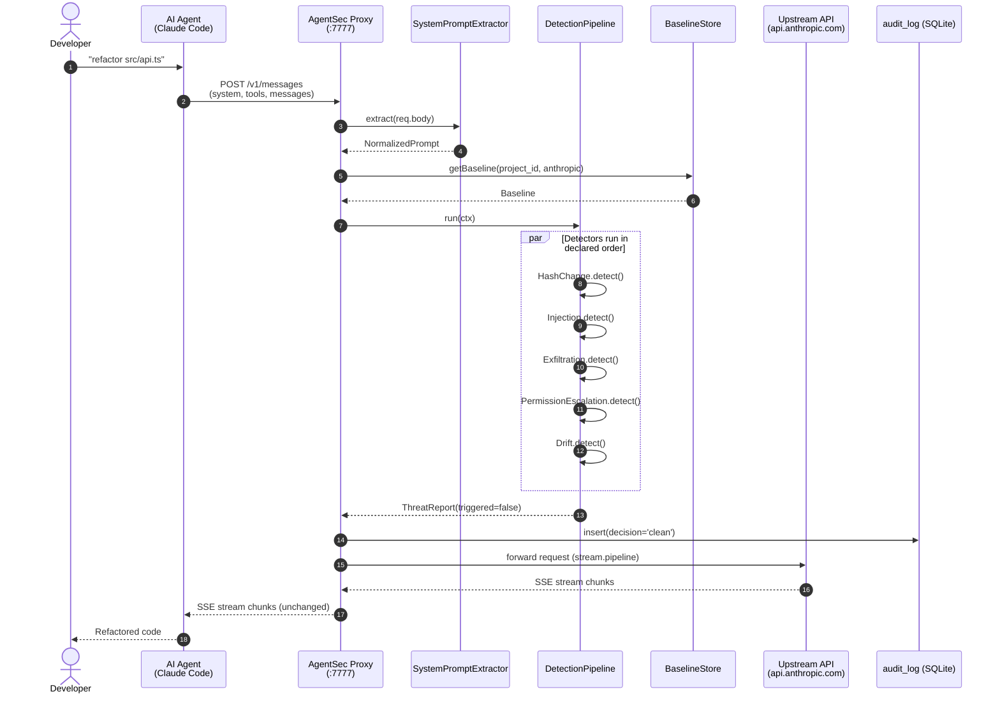

# Diagram 01 — Proxy Intercept Flow (Happy Path)

Clean request that passes all detectors and is forwarded to upstream.

**Performance contract:** P50 overhead ≤ 50ms vs direct upstream call
(NFR-1). The pipeline runs synchronously; only the upstream HTTP call is
async-streamed.

**Memory contract:** Request and response bodies are never accumulated in
memory. `stream.pipeline()` handles backpressure end-to-end.
