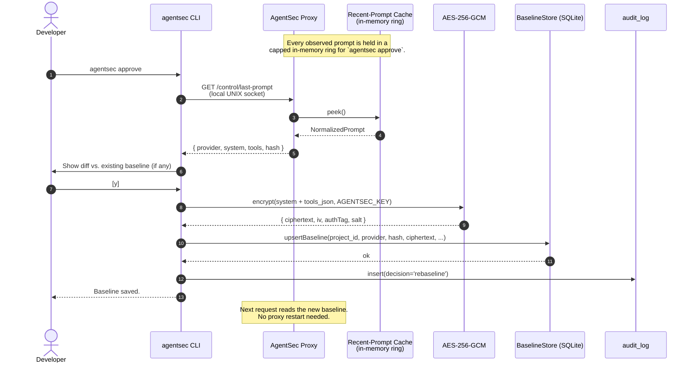

# Diagram 02 — Baseline Approval Flow

`agentsec approve` captures the most recently observed prompt and writes
an encrypted baseline.

**Atomicity:** `better-sqlite3` serializes writes. A concurrent inbound
request reads either the old baseline (if its read happened first) or the
new baseline (if the approve committed first) — never a partial state.

**Security:** Plaintext never leaves CLI memory. Encryption happens before
the SQLite write. The encryption key (`AGENTSEC_KEY`) is read from env at
CLI invocation time and discarded on process exit.
