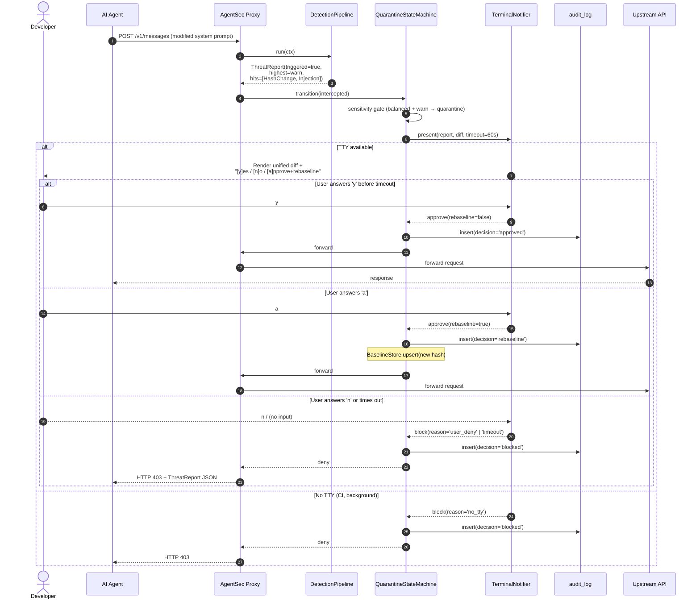

# Diagram 03 — Quarantine Flow (Threat Detected)

Detector triggers → quarantine → terminal diff prompt → user decides.

**Fail-secure invariants (NFR-9):**
- Timeout → block, never approve.
- No TTY → block immediately, never approve.
- Process crash mid-quarantine → block (request was never forwarded).
- The only paths to `approved` require explicit human input.

**Observability:** Every decision writes one row to `audit_log` with the
detector names and severity. `quarantine_timeouts.log` is appended on
timeout-blocks for ops review.
