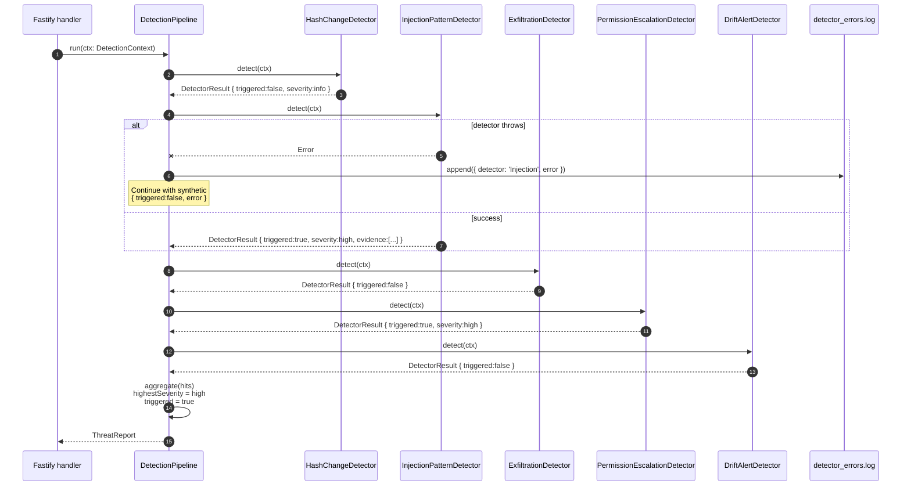

# Diagram 04 — Threat Detection Pipeline (5 Detectors)

Internal flow of `DetectionPipeline.run(ctx)`. Detectors are pure,
synchronous, isolated.

**Isolation contract (NFR-10):** One detector throwing CANNOT abort the
pipeline. The synthetic `{ triggered: false, error: '...' }` result keeps
the pipeline composable and surfaces failures via `detector_errors.log`.
A test in `tests/unit/pipeline.test.ts` injects a throwing detector and
asserts the other 4 still produce results.

**No I/O contract:** Detectors receive a fully-materialised
`DetectionContext` (prompt, baseline, exemptPatterns). They do not read
files, hit the network, or invoke async operations. This is enforced by
code review and by the NFR-13 CI grep.

**Determinism contract (NFR-13):** No detector calls any LLM. The CI script
`scripts/check-no-llm-calls.ts` fails the build if any prohibited string
appears in `src/detectors/`.
