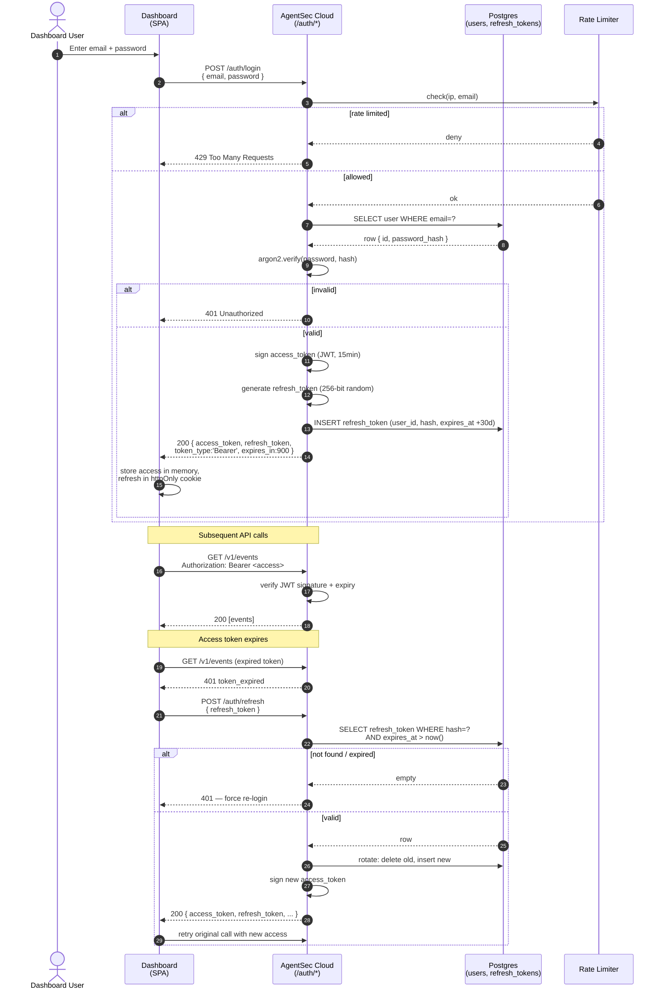

# Diagram 06 — Dashboard Auth Flow

Standard JWT login + refresh for the AgentSec Cloud dashboard. Used only
by the hosted web UI; the local proxy uses a long-lived API key.

**Security properties:**
- Passwords hashed with Argon2id (server-side; AGENTSEC_KEY is unrelated).
- Refresh tokens are rotated on every use (compromise detection: if an
  old refresh token is presented, all tokens for that user are revoked).
- Rate limiter: 5 failed logins per email per 10 min, plus per-IP cap.
- Access token JWT is 15 min; refresh token cookie is httpOnly + SameSite=Strict + Secure.
- The hosted Cloud API is OPTIONAL — the local AgentSec proxy works fully without it.

**Separation of concerns:**
- The local proxy uses an API key (header `Authorization: Bearer <key>`),
  not JWT. API keys are issued from the dashboard.
- Compromise of a dashboard JWT does not compromise the local
  `AGENTSEC_KEY` (which never leaves the developer's machine).
